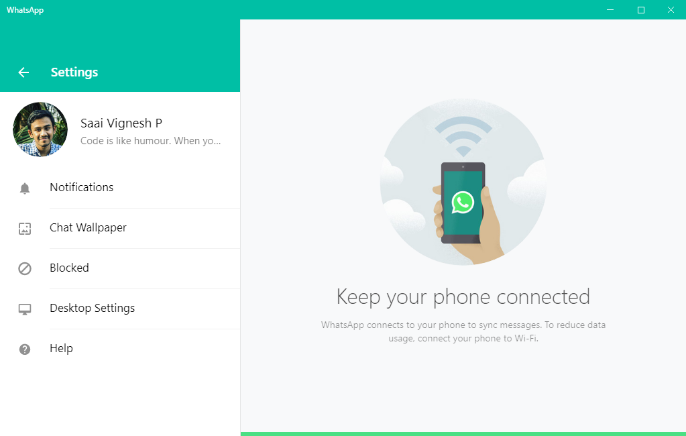
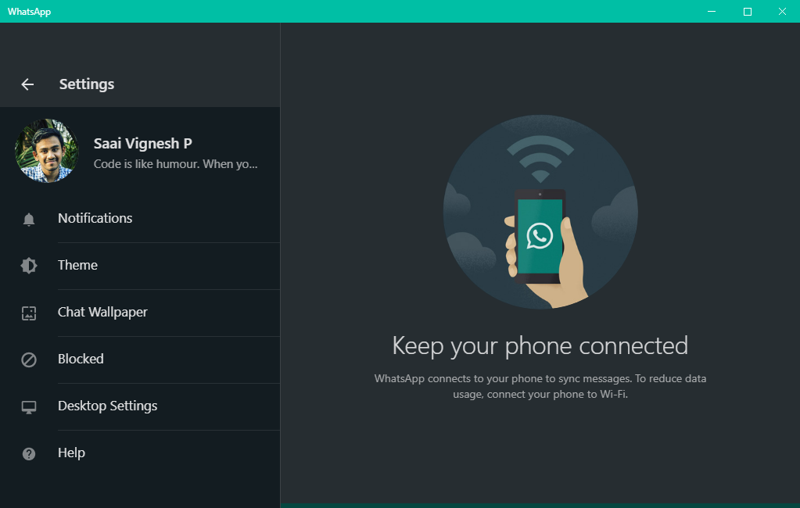

# wadesktop_dark

A magical tool which can unlock the hidden dark mode in WhatsApp Desktop. This objective of this script is to help geeky and interested people around the world to experience the upcoming official dark mode feature before it's stable rollout.

## Disclaimer

 - This script does not tamper with the natural working of the WhatsApp application. Since it is build using open-source software, this script just unlocks the upcoming feature by forcing the feature flags inside the application's settings.
 
 - Use with your own risk.

## Requirements

### NodeJS:

 - NodeJS version 10 or above required. Download from [here](https://nodejs.org).

### OS Compatibility:

 - Windows 7/8/8.1/10 x64 editions - **YES, supported.**
 - MacOS - **NOT SUPPORTED**

### WhatsApp Desktop Compatibility:

 - Tested working on Version 2.2025.7.
 - Should be installed through website not **Microsoft Store.**

## Instructions

Execute the following commands in Windows PowerShell or Command Prompt.

Clone the repository by using:

    git clone https://github.com/saaivignesh20/wadesktop_dark.git
Go into the repository directory and type the following to install dependencies:

    npm install
Finally, run the following command to execute the magical script:

    node index.js
**Enjoy the dark mode in WhatsApp Desktop App before official rollout!**

## Screenshots

## Licence

This script is licensed under General Public Licence v3.

## Feature Flag Unlockers

For more feature flag unlockers like dark mode, you are welcome to contribute to the repository under a different branch. 

If you have any idea regarding that, put a mail on saaivignesh20@gmail.com.